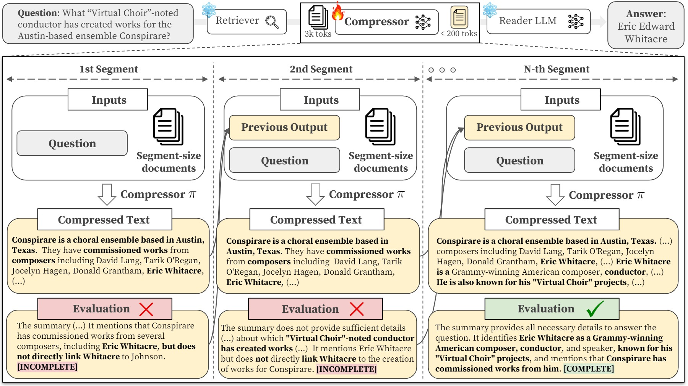

# CompAct: Compressing Retrieved Documents Actively for Question Answering

We propose [**CompAct** (**Comp**ressing Retrieved Documents **Act**ively for Question Answering)](https://arxiv.org/abs/2407.09014), a novel framework that employs an active strategy for compressing extensive documents. **CompAct** dynamically preserves query-related contexts, focusing on the integration of information across documents. See our [paper](https://arxiv.org/abs/2407.09014) for more details.

<p align="center">
    📃 <a href="https://arxiv.org/abs/2407.09014" target="_blank">Paper</a> | 🤗 <a href="https://huggingface.co/cwyoon99/CompAct-7b" target="_blank">Model</a>
</p>



## Updates
[July 16. 2024] We have released the code and data.

## Installation
To ensure compatibility with other libraries, we recommend using the following versions. You can adjust these based on your environment:
* Python 3.10.9
* PyTorch 2.1.2
* Cuda 11.8

We utilize the 'alignment-handbook' for training our model. Please install all required packages as per their instructions. More details can be found [here](https://github.com/huggingface/alignment-handbook).

```bash
# Create and activate a new environment
conda create -n compact python==3.10.9
conda activate compact

# Install pytorch
pip install torch==2.1.2 torchvision==0.16.2 torchaudio==2.1.2 --index-url https://download.pytorch.org/whl/cu118

# alignment-handbook
cd ./alignment-handbook/
python -m pip install .
python -m pip install flash-attn --no-build-isolation # Flash Attention 2

# Install our requirements
pip install -r requirements.txt
```

## Quick Usage
Here's a simple example to get you started:
```python
import json
import torch
from transformers import AutoTokenizer, AutoModelForCausalLM
from utils import create_prompt, parse_output_without_sentence

device = torch.device('cuda' if torch.cuda.is_available() else 'cpu')
model_dir = 'cwyoon99/CompAct-7b'
model = AutoModelForCausalLM.from_pretrained(model_dir, torch_dtype=torch.bfloat16, device_map="auto")
tokenizer = AutoTokenizer.from_pretrained(model_dir)

example = json.load(open('./data/example.json')) # example case with retrieved documents
print(f"question: {example['question']}\nanswer: {example['answer']}")
prev_summary = []
prev_eval = []

# actively compress documents until it finds all necessary evidence
for i, iteration in enumerate(example['iterations']):
    segment = iteration['documents_list']
    document_input = "\n".join(segment)

    # load previous output
    prev_summary_temp = prev_summary[-1] if i != 0 else ""
    prev_eval_temp = prev_eval[-1].replace('[INCOMPLETE]', '').strip() if i != 0 else ""

    # create prompt
    input_prompt = create_prompt(example, iteration, i, document_input, prev_summary_temp, prev_eval_temp, tokenizer, eos_token="", add_generation_prompt=True)
    
    # compress
    with torch.no_grad():
        inputs = tokenizer(input_prompt, return_tensors="pt")
        input_ids = inputs.input_ids.to(device)
        attention_mask = inputs.attention_mask.to(device)
        outputs = model.generate(input_ids=input_ids, attention_mask=attention_mask, max_new_tokens=500, temperature=0, top_p=1.0, pad_token_id=tokenizer.eos_token_id)
    iteration['output'] = tokenizer.decode(outputs[0][input_ids.size(1):], skip_special_tokens=True).strip()

    # parsing
    parsed_sections = parse_output_without_sentence(iteration['output'])
    prev_summary.append(parsed_sections['summary'])
    prev_eval.append(parsed_sections['eval'])
    # compressing extensive documents into compact context (under 200 tokens)
    print(f"summary of segment {i}: {iteration['summary']}\ntermination of segment {i}: {iteration['eval']}\n")

    # early termination
    if "[COMPLETE]" in iteration['eval']:
        break
```

## Download
### Model
You can download our model from [huggingface](https://huggingface.co/cwyoon99/CompAct-7b).

### Data
We conducted experiments on 5 question-answering benchmark datasets: [HotpotQA](https://github.com/hotpotqa/hotpot), [MuSiQue](https://github.com/StonyBrookNLP/musique), [2wikimultihopQA](https://github.com/Alab-NII/2wikimultihop) (2WikiMQA), [Natural Question](https://github.com/google-research-datasets/natural-questions) (NQ), and [TriviaQA](https://github.com/mandarjoshi90/triviaqa) (TQA).

Required data can be downloaded from [this Google Drive](https://drive.google.com/drive/folders/1lTz-hmb2inmU9KswLfkHag5-qRxTVujy?usp=sharing). Place it in the ```.data``` folder.
* **retrieval**: instances with retrieved results for each datasets using different retrievers. 
* **preprocessed**: 28k preprocessed instances from HotpotQA train set
* **demos**: Few-shot examples for answering questions.

## Inference
After setting up your environment and preparing the data, you can compress retrieved documents and check the end QA performance with the following script:

For convenience, you can easliy deploy our model from Huggingface. If you wish to fine-tune the base model, Please refer to the [Training](#training) section.

We also support batch decoding options (```--batch_decoding, --batch_size```) to accelerate the infernce

```bash
CUDA_VISIBLE_DEVICES=0

PRE_DIR="[your repository path]"

ret=contriever-msmarco

comp_name=cwyoon99/CompAct-7b

model_name=meta-llama/Meta-Llama-3-8B
cache_dir="[your caching paths]"

task=HotpotQA # 2wikimultihop, musique, NQ, TQA

if [ "$task" == "TQA" ]; then
    split="test"
else
    split="dev"
fi


iter=6
segment_size=5

CUDA_VISIBLE_DEVICES=$CUDA_VISIBLE_DEVICES python run_prompt.py \
    --task $task \
    --data_path $PRE_DIR/data/retrieval/$ret"_"$task/$split.json \
    --fshot \
    --fshot_path $PRE_DIR/data/demos/fshot_$task.json \
    --compress_output_dir $PRE_DIR/data/experiments/compress/$ret"_"$task/$split \
    --read_output_dir $PRE_DIR/data/experiments/test/$ret"_"$task/$split \
    --compressor_name_or_path $comp_name \
    --model_name_or_path $model_name \
    --cache_dir $cache_dir \
    --batch_decoding \
    --batch_size 20 \
    --read_wo_prev_eval \
    --segment_size $segment_size \
    --max_iteration $iter \
```
> If you want to use your self-trained model, specify the following arguments:   
> --compressor_dir e.g. $PRE_DIR/data/experiments/train/   
> --compressor_name_or_path e.g. "[name of trained model]"   
> --checkpoint e.g. checkpoint-378

## Training
We apply Supervised Fine-Tuning (SFT) using only the subset of [HotpotQA](https://github.com/hotpotqa/hotpot). You may change specific hyperparameters and training arguments in ```./alignment-handbook/recipes/mistral-7b-instruct-v0.2/sft/config_full.yaml```

For more information about data and training details, Please refer to our paper.

```bash
cd CompAct/alignment-handbook

export CUDA_VISIBLE_DEVICES="[GPU_ID]" # e.g. 0,1,2,3
export n_processes="[N_GPU]" # e.g. 4

# ./scripts/run_sft.sh
CUDA_VISIBLE_DEVICES=$CUDA_VISIBLE_DEVICES ACCELERATE_LOG_LEVEL=info accelerate launch --config_file recipes/accelerate_configs/deepspeed_zero3.yaml --num_processes $n_processes scripts/run_sft.py recipes/mistral-7b-instruct-v0.2/sft/config_full.yaml

```

<!-- ## Etc

### Retriever (Contriever)
If you want to deploy
we use [Contriever](https://github.com/facebookresearch/contriever) fine-tuned on [MS-MARCO](https://microsoft.github.io/msmarco/), as our default retrieval system (on the 2018 Wikipedia corpus).
```bash
# https://github.com/facebookresearch/contriever?tab=readme-ov-file#evaluation
wget https://dl.fbaipublicfiles.com/contriever/embeddings/contriever/wikipedia_embeddings.tar
wget https://dl.fbaipublicfiles.com/contriever/embeddings/contriever-msmarco/wikipedia_embeddings.tar -->
<!-- ``` -->

## Citation
```
@article{yoon2024compact,
      title={CompAct: Compressing Retrieved Documents Actively for Question Answering}, 
      author={Chanwoong Yoon and Taewhoo Lee and Hyeon Hwang and Minbyul Jeong and Jaewoo Kang},
      journal={arXiv preprint arXiv:2407.09014},
      year={2024},
      url={https://arxiv.org/abs/2407.09014}, 
}
```


## Contact
For more information or any questions of our work, feel free to contact me (cwyoon99 (at) korea.ac.kr or gmail.com). 
